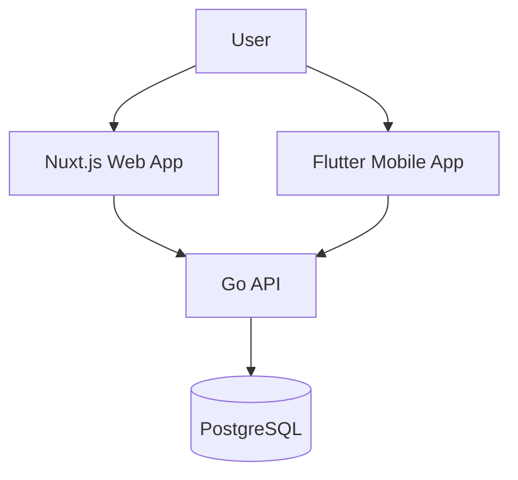

# 👋 Hi, I'm Artem

**Backend-focused Software Engineer** with over 5 years of commercial experience in **Golang**. I specialize in building scalable, maintainable backend systems with a strong foundation in **microservices architecture**. I'm passionate about creating complete solutions from infrastructure to user interface.

   
   

   📫 How to reach me: <a href='mailto:azadorov1234@gmail.com'>azadorov1234@gmail.com</a>

---

## 🛠 Technical Stack
*   **Languages:** Golang (Primary), Python, JavaScript/TypeScript, Dart
*   **Databases:** PostgreSQL, MySQL, MongoDB, Redis
*   **Backend:** Go stdlib, Gin, Echo, gorilla/mux, REST/gRPC, JWT, Swagger/OpenAPI
*   **DevOps & Tools:** Linux, Docker, Docker Compose, Git (GitHub/GitLab), CI/CD (Jenkins/GitHub Actions), Nginx
*   **Frontend & Mobile:** Vue.js/Nuxt.js, Flutter

---

## 🚀 Featured Project: Poliglotim – Full-Stack Learning Platform

A comprehensive pet-project demonstrating my ability to design, develop, and deploy a full-featured application from the ground up. It's a multi-platform platform for language courses.

### **Architecture Overview**
This project follows a clean, modular architecture, showcasing my skills in system design and cross-platform development.

### **Project Components**

| Component | Tech Stack | Description | My Contribution & Highlights |
| :--- | :--- | :--- | :--- |
| **[poliglotim-api](https://github.com/imirjar/poliglotim-api)** (Backend) | **Golang**, PostgreSQL, Docker | Core REST API serving business logic, user management, and course content. | Designed API structure, auth system (JWT), database models, caching layer, and deployment setup. Showcases clean Go code and architecture. |
| **[poliglotim-site](https://github.com/imirjar/poliglotim-site)** (Web Client) | **Nuxt.js** (Vue.js), Vuetify | Company website and user portal for browsing and managing courses. | Built responsive frontend, integrated with API, ensured performance and SEO. |
| **[poliglotim-app](https://github.com/imirjar/poliglotim-app)** (Mobile Client) | **Flutter**, Dart | Cross-platform mobile application for on-the-go learning. | Developed mobile UI/UX, state management, and seamless API integration for iOS & Android. |

**🔗 Project Goals Met:** This project allowed me to practice **system design**, **API development**, **state management** on clients, and **end-to-end product development**.

---

## 👷 Professional Experience
*   **Team Lead, Support Developer Group** – Led a team providing technical assistance, bug fixes, and enhancements for enterprise software users. Improved processes and mentored junior developers.
*   **Business Process Automation Engineer** – Developed outsourced warehouse accounting programs for **[PMI](https://www.pmi.com/)**.
*   **Freelance Developer** – Created and maintained **[reDBeaver](https://www.redbeaver.ru/)**, a tool for database management and analytics.

---

## 📈 What I'm focused on now
*   Deepening my expertise in **high-load systems** and **distributed systems** design.
*   Exploring **Kubernetes** and advanced **cloud-native** patterns.
*   Improving best practices in **code maintainability** and **team mentorship**.

---

### 📊 GitHub Stats

  
  

---

**⚡ I believe in the right tool for the job, clean code, and continuous learning.** Feel free to check out my repositories and get in touch!

---
